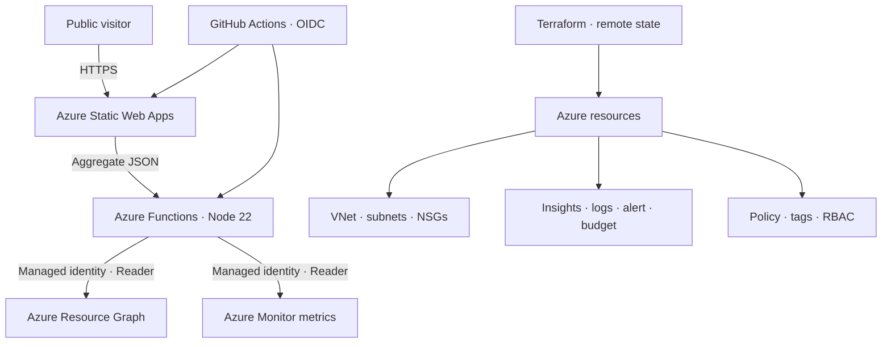

# Azure CloudOps Portfolio

A live, public cloud-engineering portfolio that demonstrates how a small Azure environment is provisioned, secured, observed, governed, and delivered.

**Live dashboard:** https://wonderful-bush-0b51e040f.6.azurestaticapps.net

The dashboard uses real Azure control-plane data. Its anonymous API deliberately publishes only aggregate health and compliance signals—never subscription IDs, resource IDs, role-assignment scopes, tokens, or network address ranges.

## What this project demonstrates

- Existing Azure networking imported into Terraform without recreation
- Remote Terraform state in Azure Blob Storage with Azure AD authentication
- Three-tier VNet segmentation with subnet-level NSGs
- Azure Static Web Apps for a public dashboard
- Azure Functions Flex Consumption running Node.js 22
- System-assigned managed identity with resource-group-scoped Reader access
- GitHub Actions deployment through OIDC workload federation
- Application Insights and Log Analytics diagnostics
- HTTP 5xx alerting through an Azure Monitor action group
- Audit-only Azure Policy for required tags and allowed locations
- A $5 monthly budget with actual and forecast notifications
- Privacy-safe live APIs backed by Azure Resource Graph and Azure Monitor
- Automated API tests and Terraform format/validation checks

## Architecture



More detail is in [docs/architecture.md](docs/architecture.md).

## Live API

| Endpoint | Public response |
|---|---|
| `GET /api/overview` | Resource totals, region set, delivery model, budget |
| `GET /api/networking` | VNet, subnet, NSG, and protection counts |
| `GET /api/security` | Identity, TLS, OIDC, and NSG control status |
| `GET /api/monitoring` | 24-hour request, latency, HTTP 5xx, and success metrics |
| `GET /api/governance` | Tag coverage, location compliance, policies, and budget thresholds |

The API uses the Function App's system-assigned identity. No Azure credential is present in application code.

## Repository layout

```text
.
├── .github/workflows/       # App deployment and Terraform validation
├── api/                     # Functions, shared helpers, and tests
├── docs/                    # Architecture, runbook, troubleshooting
├── monitoring/              # KQL investigations
├── src/                     # Static dashboard
└── terraform/               # Azure infrastructure
```

## Deploy infrastructure

Requirements: Terraform, Azure CLI, an authenticated Azure session, and Azure permissions for RBAC, Policy, Monitor, and Cost Management.

```powershell
Set-Location .\terraform

$env:TF_VAR_subscription_id = az account show --query id --output tsv
$env:TF_VAR_alert_email_address = "your-email@example.com"

terraform init
terraform fmt -check -recursive
terraform validate
terraform plan "-out=cloudops.tfplan"
terraform apply "cloudops.tfplan"
```

Review the plan before applying. Terraform state and plan files are ignored by Git.

## Application development

```powershell
Set-Location .\api
npm install
npm test
func start --javascript
```

See [docs/runbook.md](docs/runbook.md) for environment variables and production verification.

## CI/CD

| Workflow | Trigger | Authentication | Purpose |
|---|---|---|---|
| Static Web App | Changes under `src/` | SWA deployment token | Deploy dashboard |
| Function App | Changes under `api/` | Azure OIDC | Test and deploy API |
| Terraform checks | Changes under `terraform/` | None | Format and validate |

Infrastructure apply remains a reviewed operator action so an unreviewed push cannot mutate Azure.

## Cost and safety

- Static Web Apps uses the Free tier.
- Functions uses Flex Consumption with 512 MB instances.
- Log Analytics retains 30 days, capped at 0.5 GB daily ingestion.
- A $5 monthly budget covers both project resource groups.
- Policies use `Audit`, not `Deny`.
- Public endpoints return aggregates only.

## Author

**Justin Cheng**  
AZ-104 certified · Building toward a junior cloud engineering role
