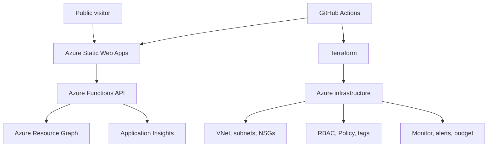

# Azure CloudOps Dashboard

A public Azure operations portfolio that demonstrates how a cloud engineer deploys, secures, monitors, governs, and automates a small Azure environment.

> **Current status:** V1 source is ready for Azure Static Web Apps deployment. The dashboard clearly displays sample metrics until live Azure integration is implemented.

## Project goal

This project goes beyond certification knowledge by presenting a production-style CloudOps workflow: application hosting, infrastructure as code, networking, identity, observability, governance, CI/CD, and cost control.

## Target architecture



## Current V1

- `src/index.html` contains a responsive HTML/CSS/JavaScript dashboard.
- `api/src/functions/overview.js` exposes `GET /api/overview` using Azure Functions Node.js v4.
- The API currently returns sample data so deployment can be validated before Azure Resource Graph integration.
- `src/staticwebapp.config.json` defines SPA fallback, API routing, and security headers.
- `api/package-lock.json` provides reproducible dependency installation.

## Technologies

| Area | Services and tools |
|---|---|
| Front end | HTML, CSS, JavaScript, Azure Static Web Apps |
| API | Azure Functions |
| Infrastructure | Terraform, VNet, subnets, NSGs |
| Identity and security | Managed identity, RBAC, HTTPS |
| Operations | Azure Monitor, Application Insights, alerts, budgets |
| Governance | Azure Policy and resource tags |
| Automation | GitHub Actions |

## Repository structure

```text
azure-cloud-ops/
├── src/
│   ├── index.html
│   └── staticwebapp.config.json
├── api/
│   ├── host.json
│   ├── package.json
│   ├── package-lock.json
│   └── src/functions/
│       └── overview.js
├── docs/
│   └── architecture.md
├── .github/workflows/       # Azure adds the deployment workflow
├── .gitignore
├── LICENSE
└── README.md
```

## Local preview

Static front end:

```powershell
cd src
python -m http.server 8080
```

Open `http://localhost:8080`.

Front end and managed API with the Azure Static Web Apps CLI:

```powershell
npm install -g @azure/static-web-apps-cli
cd api
npm install
cd ..
swa start src --api-location api
```

Open `http://localhost:4280`.

## Azure Static Web Apps deployment settings

When creating the Azure Static Web App, connect this repository and use:

| Setting | Value |
|---|---|
| Branch | `main` |
| App location | `src` |
| API location | `api` |
| Output location | Leave blank |

Azure will create the GitHub Actions workflow and deployment secret automatically.

## Planned live-data security model

The later standalone Function App will use:

- A system-assigned managed identity
- The built-in **Reader** role scoped only to the CloudOps lab resource group
- Azure Resource Graph for resource inventory
- HTTPS-only access
- CORS restricted to the deployed Static Web Apps hostname
- No service-principal secrets in source control

## Delivery roadmap

- [x] Create the public GitHub repository
- [x] Add the V1 dashboard and sample API
- [x] Add repository documentation and secret-safe ignore rules
- [ ] Deploy with Azure Static Web Apps
- [ ] Add Terraform infrastructure
- [ ] Configure managed identity and scoped RBAC
- [ ] Replace sample metrics with Azure-backed data
- [ ] Add Application Insights, alerts, and a cost budget
- [ ] Add screenshots, troubleshooting notes, and the public URL

## Cost approach

The project favors free or serverless components, conservative telemetry retention, budget alerts, and short-lived infrastructure labs so it remains suitable for an Azure pay-as-you-go subscription.

## Author

**Justin Cheng**  
AZ-104 Certified | Building toward a junior cloud engineering role
