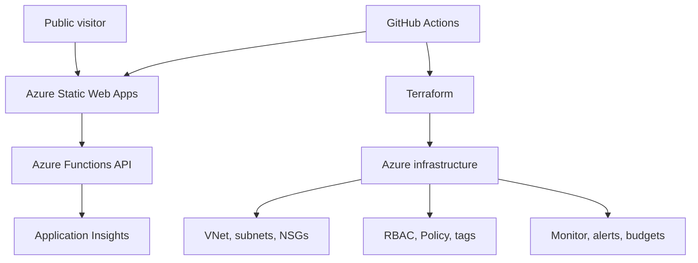

# Azure CloudOps Portfolio

A production-style Azure portfolio project demonstrating application hosting, infrastructure as code, monitoring, governance, security, and CI/CD.

> **Project status:** Foundation created. Application deployment and Azure integration are in progress.

## Project goal

This project is designed to demonstrate practical junior cloud engineering skills beyond certification knowledge. It will host a public web application while showing how the surrounding Azure environment is deployed, secured, monitored, governed, and maintained.

## Planned architecture



## Technologies

| Area | Services and tools |
|---|---|
| Application | React, Azure Static Web Apps, Azure Functions |
| Infrastructure | Azure Virtual Network, subnets, NSGs |
| Security | Microsoft Entra ID, RBAC, managed identities |
| Operations | Azure Monitor, Application Insights, alerts, budgets |
| Governance | Azure Policy and resource tags |
| Automation | Terraform and GitHub Actions |

## Intended repository structure

```text
azure-cloud-ops/
├── app/                    # Front-end application
├── api/                    # Azure Functions API
├── infra/                  # Terraform configuration
├── docs/                   # Architecture and operational documentation
├── .github/workflows/      # CI/CD workflows
├── .gitignore
├── LICENSE
└── README.md
```

Azure Static Web Apps may create its deployment workflow automatically when the Azure resource is connected to this repository.

## Delivery roadmap

- [x] Create the public GitHub repository
- [x] Add project documentation and repository safeguards
- [ ] Add and validate the front-end application
- [ ] Deploy the application with Azure Static Web Apps
- [ ] Add an Azure Functions API
- [ ] Provision supporting resources with Terraform
- [ ] Add monitoring, dashboards, alerts, and a cost budget
- [ ] Apply RBAC, tags, and Azure Policy
- [ ] Document troubleshooting and operational procedures
- [ ] Add screenshots and the public application URL

## Cost approach

The project will favor free or low-cost service tiers, conservative logging, budget alerts, and resource cleanup procedures so it can remain suitable for an Azure pay-as-you-go subscription.

## Security

Credentials, Terraform state, local environment files, and deployment tokens must never be committed. Azure and GitHub secrets will be used for deployment credentials.

## Author

**Justin Cheng**  
AZ-104 Certified | Building toward a junior cloud engineering role
