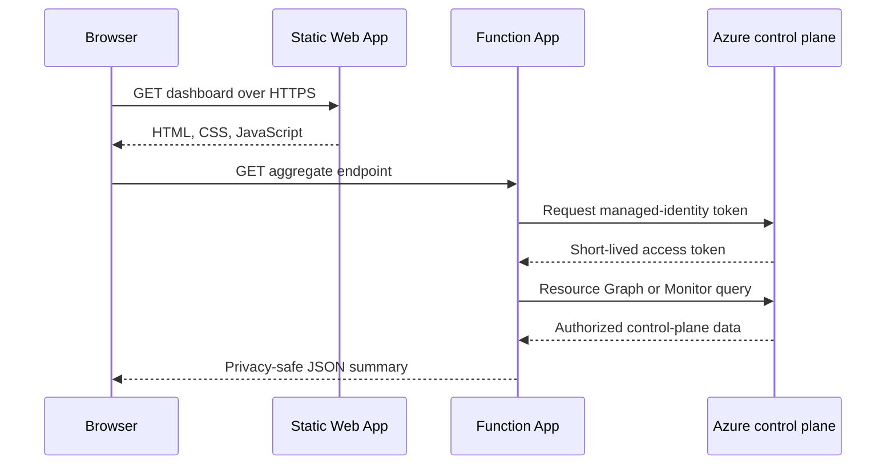

# Architecture

## Design goal

Azure CloudOps is small enough for a personal pay-as-you-go subscription while demonstrating a production operating model: infrastructure as code, identity, segmented networking, observability, governance, cost control, CI/CD, and troubleshooting.

## Resource boundaries

| Boundary | Purpose | Key resources |
|---|---|---|
| `rg-cloudops-lab` | Network and security lab | VNet, three subnets, three NSGs, security rules |
| `rg-azure-cloudops-prod` | Public app and operations | Static Web App, Function, storage, service plan, Insights, logs, alerts |

Keeping the public application separate from the lab network gives each lifecycle a clear boundary. Terraform uses data sources for both existing resource groups and manages resources inside them.

## Request and identity flow

The Function identity has Reader on only the two project resource groups and cannot mutate resources. Public responses omit resource identifiers, RBAC scopes, principal IDs, network addresses, and credentials.

## Network model

| Tier | Purpose | Inbound posture |
|---|---|---|
| Web | Public-entry workload pattern | HTTPS permitted; unrelated VNet traffic denied |
| Application | Business logic pattern | Web-to-application permitted; unrelated VNet traffic denied |
| Data | Protected data pattern | Application-to-data permitted; unrelated VNet traffic denied |

Each subnet has a dedicated NSG and Terraform-managed rules. The public serverless app does not claim private integration with this illustrative lab VNet.

## Observability

- Application Insights receives Function request and dependency telemetry.
- Workspace-based Log Analytics retains data for 30 days.
- A diagnostic setting sends supported Function logs and metrics to the workspace.
- The API reads 24-hour Azure Monitor metrics using managed identity.
- An `Http5xx` alert triggers when server errors exceed zero in five minutes.
- The action group delivers operational and budget notifications.
- Curated KQL is stored under `monitoring/`.

## Governance and cost

Two custom policies are assigned to each resource group: required-tag and allowed-location audits. The `Audit` effect reveals drift without blocking experiments. A subscription budget filtered to both groups notifies at 80% actual and 100% forecasted spend. A budget is an alerting boundary, not a hard cap.

## Delivery model

- Front-end changes deploy only the Static Web App.
- API changes run tests, authenticate with GitHub OIDC, and deploy the Function.
- Terraform changes run formatting and validation without the remote backend.
- Terraform apply is manual after reviewing a saved plan.

This separation limits blast radius and keeps infrastructure changes reviewable.
